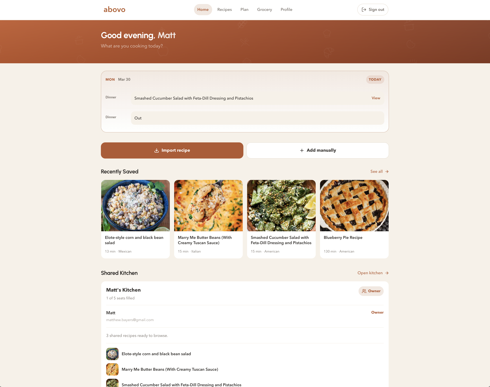
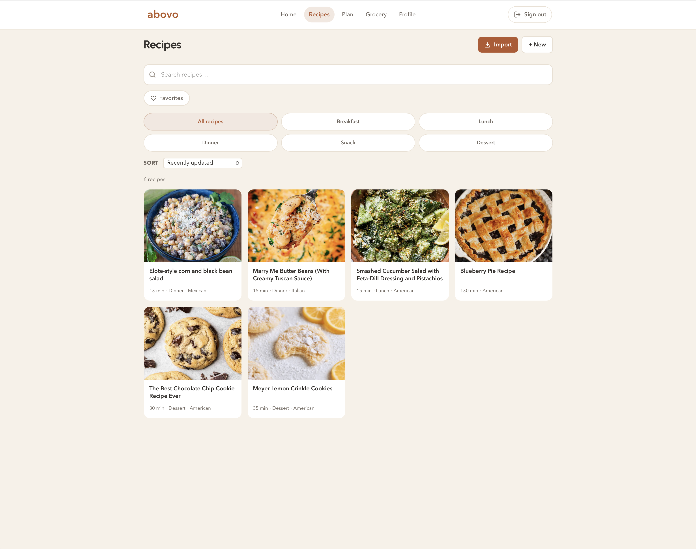
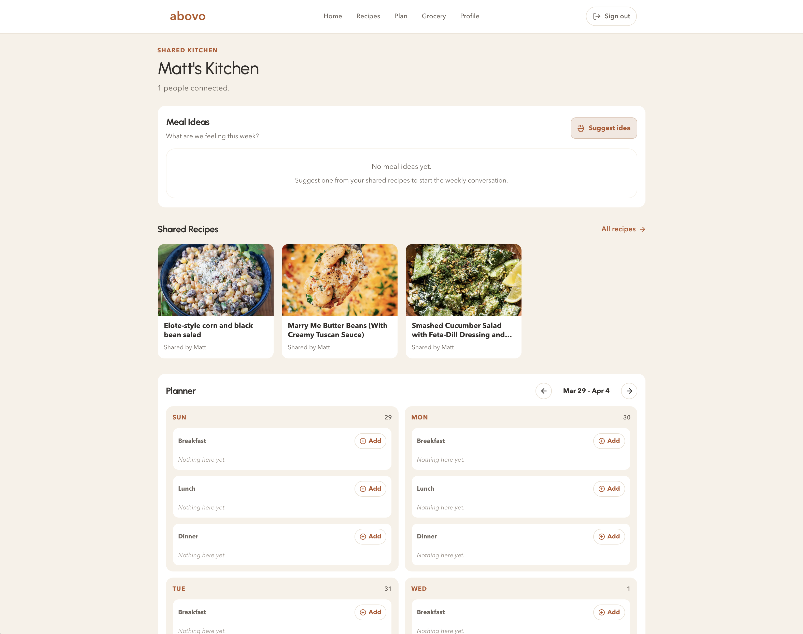
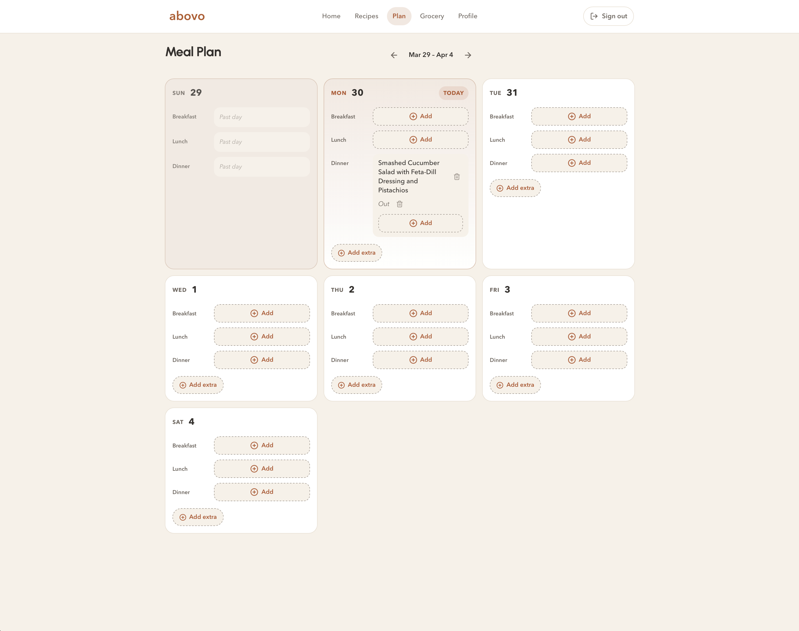
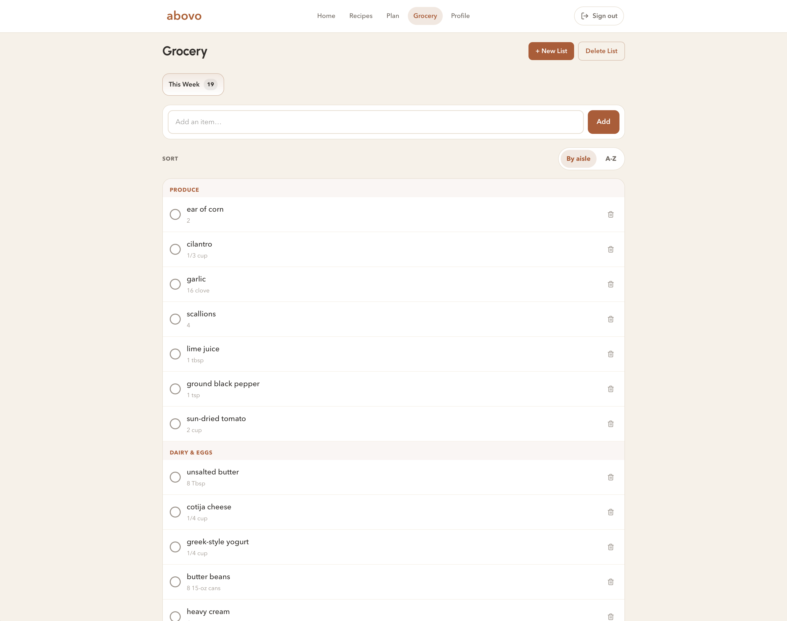
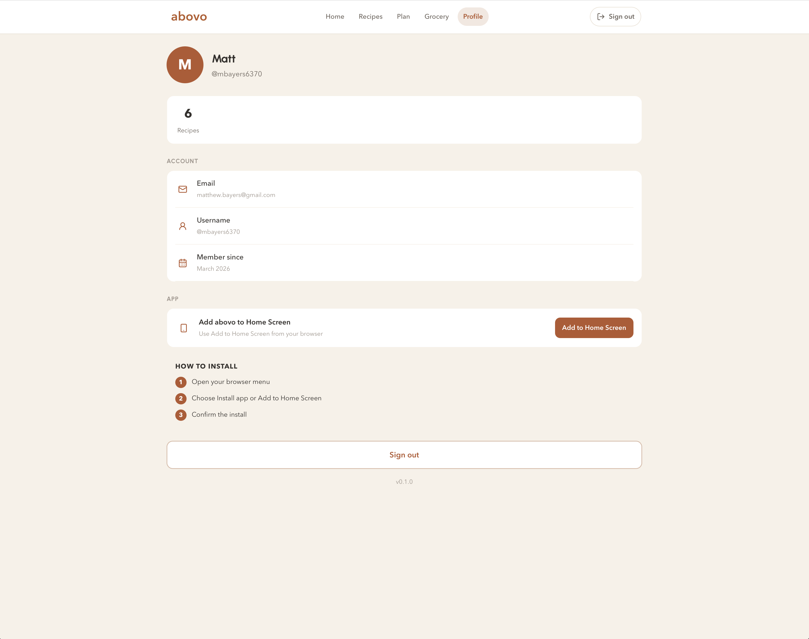

# abovo

abovo is a recipe app for capturing recipes from anywhere, planning meals for the week, building a grocery list that is actually useful in the store, and cooking from a clean step-by-step view.

It is built for real kitchen flow:

- import recipes from URLs, pasted text, and photos or screenshots
- organize recipes into folders like breakfast, dinner, snack, and dessert
- plan meals by day and meal type
- turn recipes into a normalized grocery list with aisle-aware sorting
- cook in a focused step view with inline timers
- share recipes into a shared kitchen for family or household planning
- install the app on your phone like a lightweight web app

## What abovo does

abovo is designed to cover the whole path from finding a recipe to making dinner:

1. Save or import a recipe
2. Clean up and organize it
3. Add it to a meal plan
4. Send ingredients to the grocery list
5. Cook from a simplified recipe screen

## Core Features

- Recipe import from links, pasted text, and screenshots
- Recipe editing, foldering, notes, and export
- Step-by-step cook mode with inline timers
- Weekly meal planning
- Grocery list merging, normalization, and aisle grouping
- Shared kitchen with meal ideas, shared recipes, and collaborative planning
- Mobile-friendly installable PWA experience

## Screenshots

### Home Dashboard



### Recipes



### Shared Kitchen



### Meal Plan



### Grocery



### Profile



## Tech Stack

- Next.js 16
- React 19
- Prisma
- PostgreSQL / Neon
- Zod
- Lucide React

## Quick Start

1. Install dependencies

```bash
npm install
```

2. Copy the environment file

```bash
cp .env.example .env
```

3. Fill in your local values:

- `DATABASE_URL`
- `JWT_ACCESS_SECRET`
- `JWT_REFRESH_SECRET`
- `NEXT_PUBLIC_APP_URL`

4. Run the database migrations

```bash
npm run db:migrate
```

5. Start the app

```bash
npm run dev
```

Open `http://localhost:3000`.

## Scripts

```bash
npm run dev
npm run build
npm run start
npm run lint
npm run typecheck
npm run db:migrate
npm run db:generate
npm run db:studio
```

## Project Structure

```text
app/
  (app)/        Authenticated product pages
  (auth)/       Login and signup
  api/          API route handlers
  offline/      Offline fallback page
components/     Shared UI and layout components
context/        React providers
lib/            Auth, parsing, grocery, utilities
prisma/         Schema and migrations
public/         Static assets, icons, PWA files
scripts/        Data cleanup and maintenance scripts
types/          Shared TypeScript types
```

## Deployment

Vercel is the easiest deployment target for this project.

1. Push the repo to GitHub
2. Import the repo into Vercel
3. Add the environment variables from `.env`
4. Deploy

## Notes

- Auth uses cookie-based access and refresh tokens
- Imported recipes are normalized into local app data instead of depending on the source website at read time
- Grocery items are normalized for cleaner display and smarter grouping
- The app supports install-to-home-screen on iPhone and Android

## Setup Guide

For the full environment setup, deployment flow, and local development details, see [SETUP.md](./SETUP.md).
